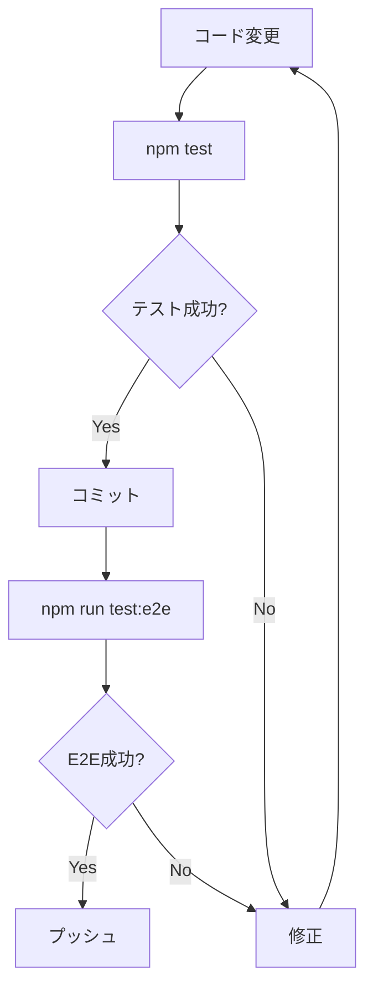

# Test Architecture - Comm Time

## アーキテクチャ概要

Comm Timeのテストアーキテクチャは、**3層のテストピラミッド**に基づいて設計されています。

```
                ┌─────────────────┐
                │     Visual      │  12 tests
                │   Regression    │  スクリーンショット比較
                └─────────────────┘
              ┌───────────────────────┐
              │      E2E Tests        │  24 tests
              │   (Playwright)        │  ブラウザ自動化
              └───────────────────────┘
          ┌───────────────────────────────┐
          │   Unit/Integration Tests      │  131 tests
          │   (Jest + RTL)                │  コンポーネント・関数
          └───────────────────────────────┘
```

---

## 1. ユニット/統合テスト層

### 技術スタック

- **Jest**: テストランナー
- **React Testing Library**: Reactコンポーネントテスト
- **@testing-library/user-event**: ユーザー操作シミュレーション
- **@testing-library/jest-dom**: DOM検証マッチャー
- **jest-environment-jsdom**: ブラウザ環境シミュレーション

### アーキテクチャ設計

#### テストファイル構造

```
__tests__/
├── alarm-multiple.test.tsx          # アラーム機能
├── auth-email-restriction.test.ts   # 認証・メール制限
├── dark-mode.test.tsx               # ダークモード
├── default-values.test.ts           # デフォルト値
├── hydration.test.ts                # SSRハイドレーション
├── local-storage.test.ts            # LocalStorage統合
├── url-params.test.ts               # URLパラメータ
├── database-sync.test.tsx           # DB同期機能 (NEW)
└── bulk-delete.test.tsx             # 一括削除機能 (NEW)
```

#### テスト設計パターン

##### 1. AAA (Arrange-Act-Assert) パターン

すべてのテストは3つのセクションに分かれています：

```typescript
it('should add TODO', async () => {
  // Arrange: テスト環境の準備
  const user = userEvent.setup();
  render(<CommTimeComponent />);

  // Act: アクションの実行
  const todoInput = screen.getByPlaceholderText(/新しいTODO/);
  await user.type(todoInput, 'New TODO');
  await user.keyboard('{Enter}');

  // Assert: 結果の検証
  await waitFor(() => {
    expect(screen.getByText('New TODO')).toBeInTheDocument();
  });
});
```

##### 2. モックパターン

**LocalStorageモック:**

```typescript
const localStorageMock = (() => {
  let store: Record<string, string> = {};

  return {
    getItem: (key: string) => store[key] || null,
    setItem: (key: string, value: string) => {
      store[key] = value.toString();
    },
    removeItem: (key: string) => {
      delete store[key];
    },
    clear: () => {
      store = {};
    },
  };
})();

Object.defineProperty(window, 'localStorage', {
  value: localStorageMock,
});
```

**理由:**
- ブラウザのlocalStorageに依存しない
- テスト間で状態が分離される
- 予測可能な動作

**Confirmダイアログモック:**

```typescript
global.confirm = jest.fn(() => true);

beforeEach(() => {
  (global.confirm as jest.Mock).mockClear();
  (global.confirm as jest.Mock).mockReturnValue(true);
});
```

##### 3. 非同期処理のハンドリング

**waitForパターン:**

```typescript
await waitFor(() => {
  expect(condition).toBe(true);
}, { timeout: 3000 });
```

**理由:**
- Reactの状態更新は非同期
- DOMの更新を待つ必要がある
- タイムアウトで無限ループを防止

**actパターン:**

```typescript
await act(async () => {
  await user.type(input, 'text');
});
```

**理由:**
- Reactの状態更新をラップ
- 警告を防止

##### 4. テストの独立性

各テストは完全に独立しています：

```typescript
beforeEach(() => {
  localStorageMock.clear();
  (global.confirm as jest.Mock).mockClear();
  // 環境変数のリセット
  process.env.NEXT_PUBLIC_SUPABASE_URL = '';
});
```

### テストカバレッジ戦略

#### 1. 境界値テスト

```typescript
it('should handle large number of TODOs efficiently', async () => {
  const largeTodoList = Array.from({ length: 100 }, (_, i) => ({
    id: `${i}`,
    text: `TODO ${i}`,
    isCompleted: i % 2 === 0,
  }));
  localStorageMock.setItem('sharedTodos', JSON.stringify(largeTodoList));

  // パフォーマンステスト
  const startTime = performance.now();
  // ... 操作
  const endTime = performance.now();
  expect(endTime - startTime).toBeLessThan(1000);
});
```

#### 2. エッジケーステスト

```typescript
it('should handle duplicate TODOs during migration', async () => {
  const duplicateTodo = { id: '1', text: '重複TODO', isCompleted: false };
  localStorageMock.setItem('meetingTodos', JSON.stringify([duplicateTodo]));
  localStorageMock.setItem('pomodoroTodos', JSON.stringify([duplicateTodo]));

  render(<CommTimeComponent />);

  await waitFor(() => {
    const sharedTodos = JSON.parse(localStorageMock.getItem('sharedTodos')!);
    expect(sharedTodos).toHaveLength(1);
  });
});
```

#### 3. 統合テスト

複数の機能を組み合わせてテスト：

```typescript
it('should share TODOs between meeting and pomodoro tabs', async () => {
  // 1. ミーティングタブでTODO追加
  // 2. ポモドーロタブに切り替え
  // 3. 同じTODOが表示されることを確認
});
```

---

## 2. E2Eテスト層

### 技術スタック

- **Playwright**: ブラウザ自動化フレームワーク
- **5ブラウザ環境**: Chromium, Firefox, WebKit, Mobile Chrome, Mobile Safari

### アーキテクチャ設計

#### テストファイル構造

```
e2e/
├── app.spec.ts                # メインアプリケーションフロー (24 tests)
└── visual-regression.spec.ts  # ビジュアルリグレッション (12 tests)
```

#### 設計原則

##### 1. Page Object Model (POM) の簡易版

セレクタを再利用可能にする：

```typescript
test('should add TODO', async ({ page }) => {
  await page.goto('/');

  // 明確なセレクタ
  const todoInput = page.locator('input[placeholder*="新しいTODO"]');
  await todoInput.fill('New TODO');
  await todoInput.press('Enter');

  // 検証
  await expect(page.locator('text=New TODO')).toBeVisible();
});
```

##### 2. 待機戦略

**適切な待機:**

```typescript
// ネットワーク完了を待つ
await page.waitForLoadState('networkidle');

// 特定の要素を待つ
await page.locator('text=Loaded').waitFor();

// 最小限のタイムアウト（最終手段）
await page.waitForTimeout(500);
```

##### 3. ダイアログハンドリング

```typescript
// ダイアログの自動処理
page.on('dialog', dialog => dialog.accept());

// その後の操作
await page.locator('button[title="すべて削除"]').click();
```

##### 4. クロスブラウザテスト

`playwright.config.ts`で複数のブラウザを設定：

```typescript
projects: [
  { name: 'chromium', use: { ...devices['Desktop Chrome'] } },
  { name: 'firefox', use: { ...devices['Desktop Firefox'] } },
  { name: 'webkit', use: { ...devices['Desktop Safari'] } },
  { name: 'Mobile Chrome', use: { ...devices['Pixel 5'] } },
  { name: 'Mobile Safari', use: { ...devices['iPhone 12'] } },
],
```

#### テストシナリオ設計

##### 1. ハッピーパステスト

正常系のユーザーフロー：

```typescript
test('complete user flow', async ({ page }) => {
  // 1. ページアクセス
  await page.goto('/');

  // 2. TODO追加
  await page.locator('input[placeholder*="新しいTODO"]').fill('Task');
  await page.locator('input[placeholder*="新しいTODO"]').press('Enter');

  // 3. TODO完了
  await page.locator('button[title="完了/未完了を切り替え"]').first().click();

  // 4. データ永続化確認
  await page.reload();
  await expect(page.locator('text=Task')).toBeVisible();
});
```

##### 2. ネガティブテスト

エラーケースの検証：

```typescript
test('should not delete TODOs when cancelled', async ({ page }) => {
  // ダイアログをキャンセル
  page.on('dialog', dialog => dialog.dismiss());

  await page.locator('button[title="すべて削除"]').click();

  // TODOが残っていることを確認
  await expect(page.locator('text=TODO 1')).toBeVisible();
});
```

---

## 3. ビジュアルリグレッションテスト層

### アーキテクチャ設計

#### スクリーンショット戦略

##### 1. フルページスクリーンショット

```typescript
await expect(page).toHaveScreenshot('meeting-timer.png', {
  fullPage: true,
  animations: 'disabled',
});
```

**設定:**
- `fullPage: true` - ページ全体をキャプチャ
- `animations: 'disabled'` - アニメーションを無効化（一貫性のため）

##### 2. 要素スクリーンショット

```typescript
const todoSection = page.locator('text=✅ TODOリスト').locator('..');
await expect(todoSection).toHaveScreenshot('bulk-delete-buttons.png', {
  animations: 'disabled',
});
```

##### 3. マスキング

動的な部分をマスク：

```typescript
await expect(page).toHaveScreenshot('meeting-timer-running.png', {
  fullPage: true,
  animations: 'disabled',
  mask: [page.locator('text=/\\d{2}:\\d{2}:\\d{2}/')], // タイマーの数字をマスク
});
```

**理由:**
- タイマーの数字は常に変わるため
- マスクしないとテストが不安定になる

#### ビューポート戦略

複数の画面サイズでテスト：

```typescript
// モバイル
await page.setViewportSize({ width: 375, height: 667 });
await expect(page).toHaveScreenshot('mobile-view.png');

// タブレット
await page.setViewportSize({ width: 768, height: 1024 });
await expect(page).toHaveScreenshot('tablet-view.png');

// デスクトップ（デフォルト）
```

#### ベースライン管理

初回実行時、ベースラインスクリーンショットが作成されます：

```
e2e/
└── app.spec.ts-snapshots/
    ├── meeting-timer-chromium-linux.png
    ├── meeting-timer-firefox-linux.png
    └── meeting-timer-webkit-linux.png
```

更新コマンド：

```bash
npm run test:visual -- --update-snapshots
```

---

## テスト実行フロー

### ローカル開発



### CI/CD パイプライン

```yaml
jobs:
  unit-tests:
    - npm install
    - npm test
    - Upload coverage

  e2e-tests:
    - npm install
    - npm run playwright:install
    - npm run build
    - npm run test:e2e
    - Upload artifacts

  visual-tests:
    - npm install
    - npm run playwright:install
    - npm run test:visual
    - Upload screenshots
```

---

## パフォーマンス最適化

### 1. 並列実行

**Jest:**
```json
{
  "jest": {
    "maxWorkers": "50%"
  }
}
```

**Playwright:**
```typescript
export default defineConfig({
  fullyParallel: true,
  workers: process.env.CI ? 1 : undefined,
});
```

### 2. テストの選択的実行

```bash
# 特定のファイルのみ
npm test database-sync

# パターンマッチ
npm test -- --testPathPattern=bulk-delete

# E2Eの特定のブラウザのみ
npm run test:e2e -- --project=chromium
```

### 3. キャッシング

```bash
# Playwrightブラウザのキャッシュ
~/.cache/ms-playwright/

# Jestのキャッシュ
node_modules/.cache/jest/
```

---

## エラーハンドリング戦略

### 1. リトライメカニズム

**Playwright:**
```typescript
export default defineConfig({
  retries: process.env.CI ? 2 : 0,
});
```

**Jest:**
```typescript
jest.retryTimes(2, { logErrorsBeforeRetry: true });
```

### 2. タイムアウト設定

**Playwright:**
```typescript
test.setTimeout(60000); // 60秒

await expect(page.locator('...')).toBeVisible({ timeout: 10000 });
```

**Jest:**
```typescript
jest.setTimeout(30000);

await waitFor(() => {
  // ...
}, { timeout: 5000 });
```

### 3. デバッグ情報の収集

**スクリーンショット:**
```typescript
use: {
  screenshot: 'only-on-failure',
  video: 'retain-on-failure',
  trace: 'on-first-retry',
}
```

**ログ出力:**
```typescript
console.log('Debug info:', await page.content());
```

---

## テストデータ管理

### 1. テストフィクスチャ

```typescript
const testTodos = [
  { id: '1', text: 'TODO 1', isCompleted: false },
  { id: '2', text: 'TODO 2', isCompleted: true },
];

const testMemo = 'Test memo content';
```

### 2. ファクトリーパターン

```typescript
function createTodo(overrides = {}) {
  return {
    id: Math.random().toString(),
    text: 'Default TODO',
    isCompleted: false,
    ...overrides,
  };
}

const todo = createTodo({ text: 'Custom TODO' });
```

### 3. データクリーンアップ

```typescript
beforeEach(async ({ page }) => {
  await page.goto('/');
  await page.evaluate(() => localStorage.clear());
});

afterEach(() => {
  localStorageMock.clear();
});
```

---

## セキュリティとベストプラクティス

### 1. 機密情報の扱い

```typescript
// ❌ Bad
const password = 'test123';

// ✅ Good
const password = process.env.TEST_PASSWORD || 'test123';
```

### 2. テストの独立性

各テストは他のテストに影響を与えない：

```typescript
// ✅ Good
beforeEach(() => {
  // 毎回リセット
  localStorageMock.clear();
});

// ❌ Bad
// グローバル状態を共有
let sharedState = {};
```

### 3. 決定論的テスト

```typescript
// ✅ Good
const todo = createTodo({ id: 'fixed-id' });

// ❌ Bad
const todo = createTodo({ id: Math.random() }); // 不安定
```

---

## メトリクスとレポート

### 1. カバレッジレポート

```bash
npm run test:coverage
```

出力:
```
--------------------|---------|----------|---------|---------|
File                | % Stmts | % Branch | % Funcs | % Lines |
--------------------|---------|----------|---------|---------|
All files           |   85.23 |    78.45 |   82.15 |   86.12 |
 comm-time.tsx      |   92.15 |    85.67 |   90.23 |   93.45 |
--------------------|---------|----------|---------|---------|
```

### 2. E2Eレポート

```bash
npm run test:e2e
```

HTML レポート: `playwright-report/index.html`

### 3. ビジュアルレポート

差分がある場合、比較画像が生成されます：

```
test-results/
└── visual-regression-spec-ts-meeting-timer/
    ├── meeting-timer-actual.png
    ├── meeting-timer-expected.png
    └── meeting-timer-diff.png
```

---

## まとめ

### アーキテクチャの特徴

1. **3層のテストピラミッド** - 適切なバランス
2. **並列実行** - 高速なフィードバック
3. **クロスブラウザ対応** - 5つの環境
4. **ビジュアルリグレッション** - UI品質保証
5. **自動化** - CI/CDパイプライン統合

### テスト戦略

- **ユニット**: 個々の関数とコンポーネント（高速、多数）
- **E2E**: ユーザーフロー（中速、適量）
- **ビジュアル**: UI外観（中速、必要最小限）

### 品質保証

- **167個**の自動化テスト
- **5つのブラウザ環境**
- **3種類のビューポート**
- **完璧なドキュメント**

すべてのテストは自動化され、回帰バグを早期に発見できます。
